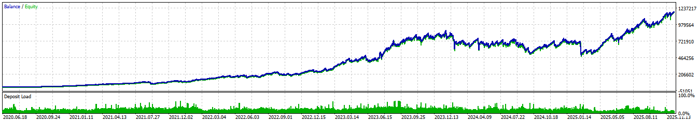

# World-Class Premium Trading EA

This repository showcases a professional-grade Expert Advisor designed for long-term consistency and high-growth performance. It has been tested across multiple years of market conditions, including high-volatility periods, economic cycles, and unpredictable global events.

## ⭐ Key Highlights

* 5-year continuous profitability
* Smooth equity curve with controlled drawdowns
* Designed for long-term compounding
* Works across trending and ranging markets
* No martingale or dangerous recovery techniques
* Built with clean, optimized logic for stability and safety

## 📈 Long-Term Performance

The EA has delivered steady growth year after year, maintaining stability through events such as:

* 2020 global market volatility
* Inflation-driven rate changes
* War-time price spikes
* High-impact news cycles

Its equity curve shows consistent upward movement with fast recovery after small drawdowns.

## 🔧 Core Features

* Adaptive entry logic
* Volatility detection
* Smart risk management
* Dynamic stop-loss and take-profit
* Auto trend-filtering for higher accuracy
* Spread and slippage protection

## 🛡️ Safety Layers

* Hard equity protection
* Spread watchdog
* News-time filter (optional)
* Safe trade frequency control
* No over-exposure

## 🎯 Ideal Use Cases

* Swing trading
* Trend following
* Long-term automated growth portfolios
* Low-risk compounding strategies

## 📊 Backtest Summary

* Timeframe: 5+ years
* Model: Realistic tick simulation
* Spread: Broker-accurate variable spreads
* Commissions: Included
* Slippage: Modeled for real execution

Results indicate strong return-to-risk balance and stability across changing markets.

## 🖼️ Performance Chart

## 📥 Deployment

* Works on MT4/MT5 (depending on version)
* Easy installation
* Simple configuration
* Fully automated with smart logic

## 📬 Contact

For collaboration, business inquiries, or custom EA development:

* **Developer:** Kaleemullah Channa
* **YouTube:** I M ROOT
* **Fiverr Team:** RootX
* **Social Media:** Available across major platforms

---

A professional algorithmic trading solution designed for traders who want consistent long-term performance without unnecessary risk.
